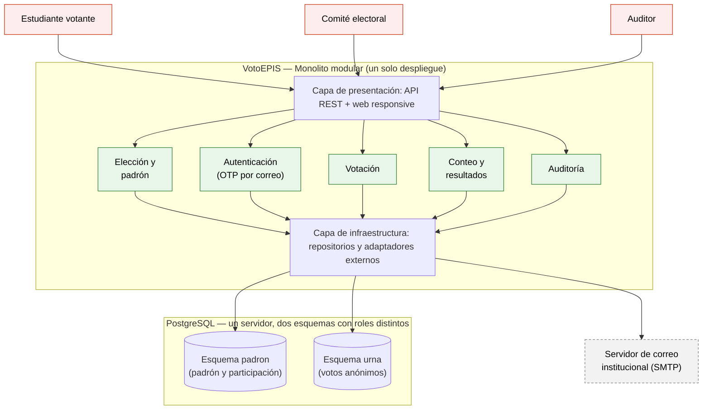

# VotoEPIS — Laboratorio 04: Fundamentos de arquitectura de software
Construcción de Software · EPIS-UNSA · 2026-B · Grupo 05

## Integrantes
| Nombre | Rol en el laboratorio (p. ej., redactor de ADR, diagramador, verificador de IA) |
|--------|------------------------------------------------------------------------------|
| Eduardo Choque | Todos |

## Caso
VotoEPIS es una plataforma web para la elección digital de delegados estudiantiles de la EPIS. Los estudiantes votan una sola vez y en secreto, el comité electoral gestiona el padrón y publica resultados y acta, y un auditor puede verificar el conteo de forma independiente. El MVP debe estar en producción en 1 mes con un equipo de 3 developers y un único servidor de bajo costo. El **atributo de calidad crítico** es la seguridad (integridad y confidencialidad): 0 votos duplicados y recuento independiente que coincide al 100 % con el oficial.

## Arquitectura elegida
Monolito modular (ADR-001). Cada módulo cubre al menos un requisito de [drivers.md](docs/architecture/drivers.md): Elección y padrón (RF-01, RF-07), Autenticación (RF-02), Votación (RF-03, RF-08), Conteo y resultados (RF-04, RF-05) y Auditoría (RF-06).

## Documentación
- [Drivers y escenarios de calidad](docs/architecture/drivers.md)
- [Matriz de decisión](docs/architecture/matriz-decision.md)
- [Bitácora de uso de IA](docs/architecture/bitacora-ia.md)
- Alternativa descartada: [alternativa.puml](docs/architecture/diagramas/alternativa.puml)
- Vista de despliegue: [despliegue.py](docs/architecture/diagramas/despliegue.py)

## Decisiones arquitectónicas
- [ADR-001: Estilo arquitectónico (monolito modular)](docs/architecture/adr/001-estilo-arquitectonico.md)
- [ADR-002: Separar identidad y voto en dos esquemas](docs/architecture/adr/002-anonimato-del-voto.md)
- [ADR-003: Autenticación con OTP al correo institucional](docs/architecture/adr/003-autenticacion-otp-correo.md)

## Reflexión sobre el uso de la IA
La IA ayudó a generar y comparar alternativas, a redactar el código de los diagramas y a anticipar riesgos con la crítica adversarial, sobre todo el de correlacionar voto y votante. También cometió errores: asumió un inicio de sesión federado que no tenía confirmado y tiende a sobredimensionar la solución. Aprendi a darle restricciones explícitas, a recalcular con un script lo que nos entrega y a registrar cada corrección en la bitácora. Las decisiones finales, y los riesgos que se aceptan (como el administrador con acceso total a la base de datos), fueron tomados por mi.-

## Notas
- Las imágenes de `diagramas/img/` se generan desde el código.
