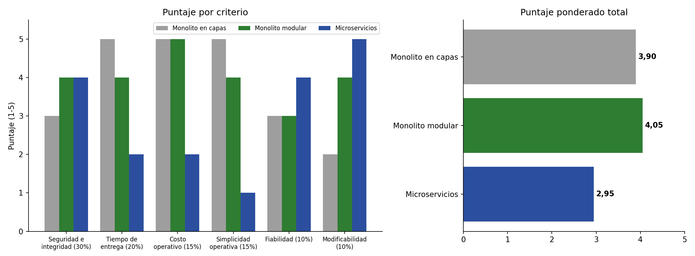

# Matriz de decisión — VotoEPIS

## Alternativas
- **A. Monolito en capas:** una sola aplicación Django organizada en presentación, lógica de negocio y acceso a datos, con una única base de datos. Es lo más rápido de construir, pero sin límites internos entre funcionalidades.
- **B. Monolito modular:** un solo despliegue dividido en 5 módulos de dominio (Elección y padrón, Autenticación, Votación, Resultados, Auditoría) que solo se comunican por interfaces públicas. Padrón y urna viven en esquemas separados de PostgreSQL.
- **C. Microservicios:** servicios independientes (identidad, votación, conteo, auditoría), cada uno con su base de datos y un broker de mensajes entre ellos, desplegados por separado.

## Criterios y pesos (deben sumar 100 %)
| Criterio                  | Peso  | Justificación (driver relacionado)                                                                      |
|---------------------------|-------|---------------------------------------------------------------------------------------------------------|
| Seguridad e integridad    | 30 %  | QA-01, QA-04, R-06: es el atributo crítico; un voto duplicado o rastreable invalida la elección          |
| Tiempo de entrega         | 20 %  | R-01: el MVP debe estar en producción en 1 mes                                                          |
| Costo operativo           | 15 %  | R-03: presupuesto bajo, un solo servidor                                                                 |
| Simplicidad operativa     | 15 %  | R-02: 3 developers sin experiencia en DevOps; menos piezas, menos superficie de error y de ataque        |
| Fiabilidad                | 10 %  | QA-02: la ventana de votación es corta, pero la carga es baja y una sola máquina la absorbe              |
| Modificabilidad           | 10 %  | Cada ciclo electoral cambia reglas y candidatos; se prioriza menos porque el sistema es de alcance acotado |

## Matriz (puntaje 1 = muy malo … 5 = excelente)
| Criterio (peso)                | A (Capas) | B (Modular) | C (Microservicios) |
|--------------------------------|-----------|-------------|--------------------|
| Seguridad e integridad (30 %)  | 3         | 4           | 4                  |
| Tiempo de entrega (20 %)       | 5         | 4           | 2                  |
| Costo operativo (15 %)         | 5         | 5           | 2                  |
| Simplicidad operativa (15 %)   | 5         | 4           | 1                  |
| Fiabilidad (10 %)              | 3         | 3           | 4                  |
| Modificabilidad (10 %)         | 2         | 4           | 5                  |
| **Total ponderado**            | **3,90**  | **4,05**    | **2,95**           |

Total ponderado = Σ (peso × puntaje).
- A: 0,30×3 + 0,20×5 + 0,15×5 + 0,15×5 + 0,10×3 + 0,10×2 = 3,90
- B: 0,30×4 + 0,20×4 + 0,15×5 + 0,15×4 + 0,10×3 + 0,10×4 = 4,05
- C: 0,30×4 + 0,20×2 + 0,15×2 + 0,15×1 + 0,10×4 + 0,10×5 = 2,95

Justificación de puntajes clave: en **seguridad**, A obtiene 3 porque nada impide que el código de votación consulte la identidad del votante; B y C obtienen 4 porque imponen fronteras (módulos con esquemas separados, o servicios aislados). En **simplicidad**, C obtiene 1: exige varios despliegues, bases de datos y un broker que 3 developers no podrían operar con seguridad en 1 mes.

*Gráfico generado con `diagramas/matriz_grafico.py`, que también recalcula los totales.*

## Afirmaciones de la IA que se corrigieron o verificaron
- La IA tiende a asumir que la universidad ofrece inicio de sesión federado con la cuenta institucional. No hay evidencia de ello en el caso, así que se decidió usar un código de un solo uso enviado al correo y se anotó confirmar con la oficina de TI (ver ADR-003).
- Una verificación individual del voto mediante recibo por votante suena atractiva para la auditoría, pero permitiría demostrar a un tercero cómo se votó (compra o coerción de votos) y choca con R-06. Se rechazó (ver ADR-002).
- Cualquier cálculo de la matriz se verificó con `matriz_grafico.py`, no a mano.

## Conclusión
Elegi **B. Monolito modular** porque obtiene el mayor puntaje (4,05), se puede construir y operar en 1 mes con 3 developers (R-01, R-02, R-03) y permite aislar la identidad del votante de la urna (R-06). La alternativa A queda en segundo lugar (3,90).
